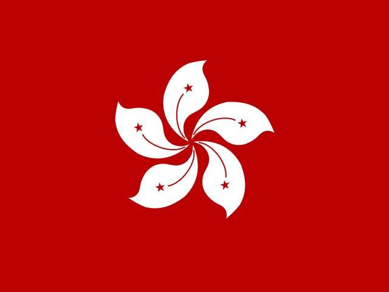
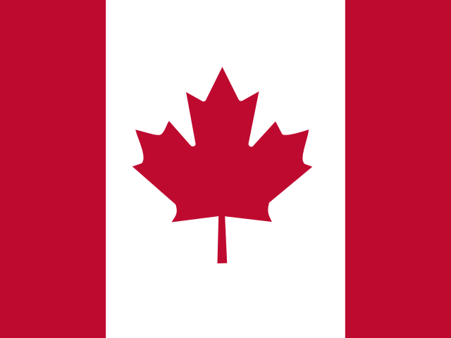

# SVG Flags of the World

  
  
  
  
  
  
  
  
  

## How do I match country to flag?
- The flag images are contained within image files named by alpha-2 country code. Therefore `images/zm` ===> the flag of Zimbabwe.
- See the link to match country to country code. https://gist.github.com/tadast/8827699

